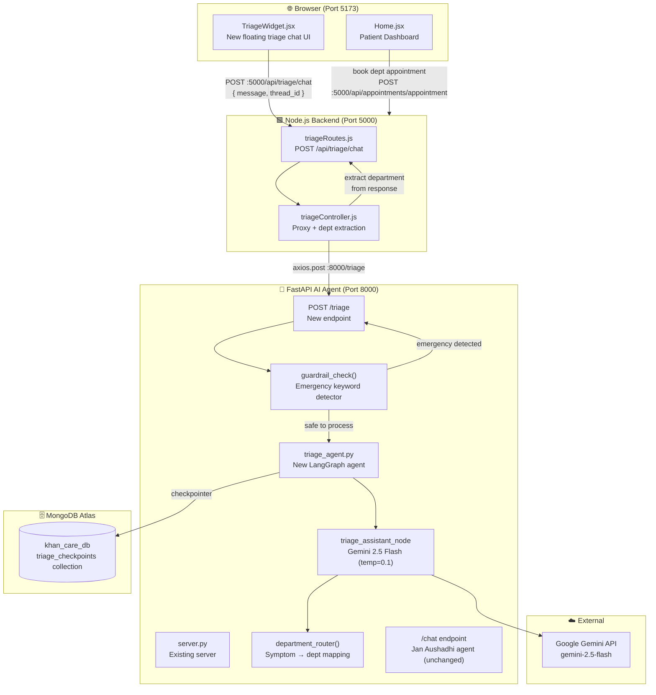
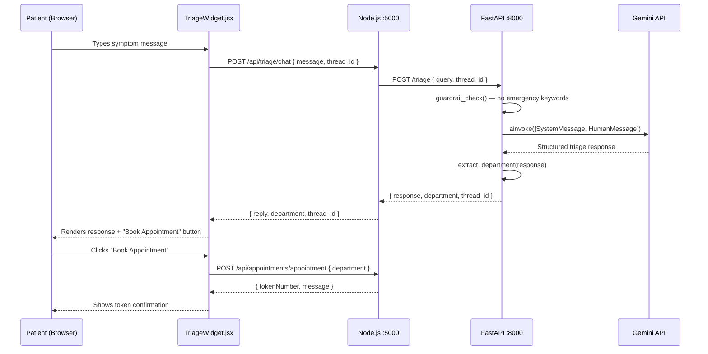
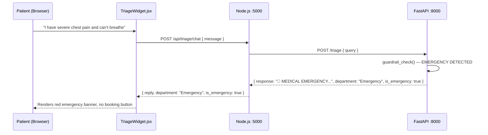

# Design Document: MediStep AI — Medical Triage Assistant

## Overview

MediStep AI is a dedicated medical triage assistant integrated into the KhanCare AI platform. It accepts patient-reported symptoms via a chat interface, applies strict guardrails to avoid diagnosis or prescription, routes patients to the correct hospital department, and escalates emergencies immediately. The feature is implemented as a new FastAPI endpoint (`/triage`) on the existing Python AI agent (port 8000), a new Express route on the Node.js backend (port 5000), and a dedicated `TriageWidget` React component on the frontend (port 5173).

MediStep AI operates as a **separate LangGraph agent** alongside the existing Jan Aushadhi medicine agent. Both agents share the same FastAPI server but maintain independent system prompts, state graphs, and conversation threads. The triage agent uses Gemini 2.5 Flash with a temperature of 0.1 (lower than the medicine agent's 0.2) to enforce strict, deterministic guardrail compliance.

The feature directly addresses Phase 2 of the KhanCare AI roadmap: "AI Receptionist — Symptom → department triage, connect AI recommendation to appointment booking."

---

## Architecture



---

## Sequence Diagrams

### Normal Triage Flow



### Emergency Escalation Flow



---

## Components and Interfaces

### Component 1: `triage_agent.py` (Python — AI Agent Layer)

**Purpose**: New LangGraph agent dedicated to medical triage. Runs alongside the existing medicine agent in the same FastAPI process.

**Interface**:
```python
class TriageState(TypedDict):
    messages: Annotated[List, add_messages]

async def triage_assistant_node(state: TriageState) -> dict:
    """Invokes Gemini with the MediStep system prompt. No tools needed."""
    ...

def create_triage_graph() -> CompiledGraph:
    """Builds and compiles the triage LangGraph StateGraph with MongoDB checkpointer."""
    ...

triage_app: CompiledGraph  # Module-level export, used by server.py
```

**Responsibilities**:
- Maintain a separate `StateGraph` from the medicine agent
- Use `triage_checkpoints` MongoDB collection (not `checkpoints`) to avoid state collision
- Run with `temperature=0.1` for strict, deterministic guardrail compliance
- No tools are bound — triage is purely LLM-driven with a strict system prompt

### Component 2: `server.py` — `/triage` endpoint (Python — AI Agent Layer)

**Purpose**: New FastAPI endpoint added to the existing `server.py`. Handles guardrail pre-check before invoking the triage agent.

**Interface**:
```python
class TriageQuery(BaseModel):
    query: str
    thread_id: Optional[str] = None

class TriageResponse(BaseModel):
    response: str
    department: Optional[str] = None
    is_emergency: bool = False
    thread_id: Optional[str] = None

@app.post("/triage", response_model=TriageResponse)
async def triage_chat(user_query: TriageQuery) -> TriageResponse:
    """
    Preconditions:
      - user_query.query is a non-empty string
    Postconditions:
      - If emergency keywords detected: is_emergency=True, department="Emergency", no LLM call
      - Otherwise: response contains empathy + advice + routing + disclaimer
      - department is always a non-None string in the response
    """
    ...
```

**Responsibilities**:
- Run `guardrail_check()` before any LLM invocation
- Inject the MediStep system prompt as `SystemMessage`
- Call `extract_department()` on the LLM response to populate the `department` field
- Return structured `TriageResponse` with `is_emergency` flag

### Component 3: `triageController.js` (Node.js — Backend Layer)

**Purpose**: Express controller that proxies triage requests from the frontend to the Python agent and passes through the structured response.

**Interface**:
```javascript
/**
 * @param {Request} req - body: { message: string, thread_id?: string }
 * @param {Response} res - json: { reply, department, is_emergency, thread_id }
 * Preconditions:  req.body.message is a non-empty string
 * Postconditions: res contains reply, department, is_emergency fields
 */
const getTriageResponse = async (req, res) => { ... }

module.exports = { getTriageResponse };
```

**Responsibilities**:
- Validate that `message` is present in request body
- Forward to `http://127.0.0.1:8000/triage` via axios
- Map Python response fields (`response` → `reply`) for frontend consistency
- Return 503 with a safe fallback message if Python agent is unreachable

### Component 4: `TriageWidget.jsx` (React — Frontend Layer)

**Purpose**: Dedicated floating chat widget for MediStep AI triage, visually distinct from the existing `ChatWidget` (Jan Aushadhi medicine assistant).

**Interface**:
```typescript
interface Message {
  sender: "user" | "ai";
  text: string;
  department?: string;
  is_emergency?: boolean;
}

interface TriageWidgetProps {} // No props — self-contained

const TriageWidget: React.FC<TriageWidgetProps> = () => { ... }
```

**Responsibilities**:
- Render as a second floating button (bottom-right, above the existing ChatWidget)
- Display emergency messages with a red banner and no booking button
- Display department routing with a "Book Appointment" button that pre-fills the department
- Maintain `thread_id` in component state for conversation continuity
- Call `POST :5000/api/triage/chat` (through Node.js, not directly to Python)

---

## Data Models

### TriageQuery (Python Pydantic)

```python
class TriageQuery(BaseModel):
    query: str           # Patient's symptom description; must be non-empty
    thread_id: Optional[str] = None  # Conversation ID; auto-generated if None
```

**Validation Rules**:
- `query` must be a non-empty string (FastAPI validates automatically)
- `thread_id` defaults to `"triage_default"` if not provided

### TriageResponse (Python Pydantic)

```python
class TriageResponse(BaseModel):
    response: str                    # Full formatted triage response text
    department: Optional[str] = None # Extracted department name
    is_emergency: bool = False       # True if emergency protocol triggered
    thread_id: Optional[str] = None  # Echo back the thread_id used
```

**Validation Rules**:
- `response` is always non-empty
- `department` is one of: `"General Physician"`, `"Gynecologist"`, `"Cardiologist"`, `"Orthopedic"`, `"Gastroenterologist"`, `"Neurologist"`, `"Dermatologist"`, `"Pediatrician"`, `"Emergency"`, or `None`
- `is_emergency` is `True` only when emergency keywords are detected in the raw query

### DepartmentMap (Python constant)

```python
DEPARTMENT_MAP: dict[str, str] = {
    "gynecologist":       "Gynecologist / Obstetrics",
    "obstetrics":         "Gynecologist / Obstetrics",
    "cardiologist":       "Cardiologist",
    "orthopedic":         "Orthopedic",
    "gastroenterologist": "Gastroenterologist",
    "neurologist":        "Neurologist",
    "general physician":  "General Physician (Medicine)",
    "dermatologist":      "Dermatologist",
    "pediatrician":       "Pediatrician",
    "emergency":          "Emergency",
}

EMERGENCY_KEYWORDS: list[str] = [
    "chest pain", "severe bleeding", "can't breathe", "cannot breathe",
    "difficulty breathing", "stroke", "unconscious", "heart attack",
    "not breathing", "severe chest"
]
```

---

## Algorithmic Pseudocode

### Main Triage Endpoint Algorithm

```python
ALGORITHM triage_chat(user_query: TriageQuery) -> TriageResponse
INPUT:  user_query with .query (str) and .thread_id (Optional[str])
OUTPUT: TriageResponse with response, department, is_emergency, thread_id

PRECONDITIONS:
  - user_query.query is non-empty string
  - triage_app (LangGraph compiled graph) is initialized

POSTCONDITIONS:
  - If is_emergency=True: response contains emergency message, no LLM called
  - If is_emergency=False: response contains empathy + advice + routing + disclaimer
  - department is always populated (never None in final response)
  - thread_id echoed back to caller

BEGIN
  thread_id = user_query.thread_id OR "triage_" + uuid4()

  # Step 1: Emergency guardrail (pre-LLM check)
  IF guardrail_check(user_query.query) == EMERGENCY THEN
    RETURN TriageResponse(
      response   = EMERGENCY_MESSAGE,
      department = "Emergency",
      is_emergency = True,
      thread_id  = thread_id
    )
  END IF

  # Step 2: Build messages for LangGraph
  system_msg = SystemMessage(content=MEDISTEP_SYSTEM_PROMPT)
  human_msg  = HumanMessage(content=user_query.query)
  config     = RunnableConfig(configurable={"thread_id": thread_id})

  # Step 3: Invoke triage agent
  result   = AWAIT triage_app.ainvoke({"messages": [system_msg, human_msg]}, config)
  messages = result.get("messages", [])

  # Step 4: Extract response text
  IF messages is empty THEN
    response_text = "I'm sorry, I couldn't process your request. Please try again."
  ELSE
    response_text = extract_text(messages[-1])
  END IF

  # Step 5: Extract department from response text
  department = extract_department(response_text)

  RETURN TriageResponse(
    response     = response_text,
    department   = department,
    is_emergency = False,
    thread_id    = thread_id
  )
END
```

**Loop Invariants**: N/A (no loops in main flow)

### Guardrail Check Algorithm

```python
ALGORITHM guardrail_check(query: str) -> bool
INPUT:  query — raw patient message (lowercase comparison applied)
OUTPUT: True if emergency detected, False otherwise

PRECONDITIONS:
  - query is a non-empty string
  - EMERGENCY_KEYWORDS list is initialized and non-empty

POSTCONDITIONS:
  - Returns True if ANY keyword from EMERGENCY_KEYWORDS is a substring of query.lower()
  - Returns False if NO keyword matches
  - Does NOT modify query

BEGIN
  query_lower = query.lower()

  FOR keyword IN EMERGENCY_KEYWORDS DO
    # Loop invariant: all previously checked keywords were NOT found in query_lower
    IF keyword IN query_lower THEN
      RETURN True
    END IF
  END FOR

  RETURN False
END
```

**Loop Invariants**: All previously checked keywords were not found in `query_lower`

### Department Extraction Algorithm

```python
ALGORITHM extract_department(response_text: str) -> Optional[str]
INPUT:  response_text — full LLM-generated triage response
OUTPUT: department name string or None

PRECONDITIONS:
  - response_text is a non-empty string
  - DEPARTMENT_MAP keys are lowercase strings

POSTCONDITIONS:
  - Returns the FIRST matching department key found in response_text (case-insensitive)
  - Returns None if no department keyword is found
  - Does NOT modify response_text

BEGIN
  text_lower = response_text.lower()

  FOR key, dept_name IN DEPARTMENT_MAP.items() DO
    # Loop invariant: no department has been matched yet
    IF key IN text_lower THEN
      RETURN dept_name
    END IF
  END FOR

  RETURN None
END
```

---

## Key Functions with Formal Specifications

### `guardrail_check(query: str) -> bool`

```python
def guardrail_check(query: str) -> bool:
```

**Preconditions:**
- `query` is a non-empty string
- `EMERGENCY_KEYWORDS` is a non-empty list of lowercase strings

**Postconditions:**
- Returns `True` if any emergency keyword is a substring of `query.lower()`
- Returns `False` otherwise
- No side effects; `query` is not mutated

**Loop Invariants:**
- At each iteration, no keyword checked so far was found in `query_lower`

### `extract_department(response_text: str) -> Optional[str]`

```python
def extract_department(response_text: str) -> Optional[str]:
```

**Preconditions:**
- `response_text` is a non-empty string

**Postconditions:**
- Returns the canonical department name string if a keyword match is found
- Returns `None` if no match found
- No side effects; `response_text` is not mutated

### `triage_assistant_node(state: TriageState) -> dict`

```python
async def triage_assistant_node(state: TriageState) -> dict:
```

**Preconditions:**
- `state["messages"]` is a non-empty list containing at least one `SystemMessage` and one `HumanMessage`
- `triage_llm` (Gemini 2.5 Flash, temp=0.1) is initialized

**Postconditions:**
- Returns `{"messages": [ai_response]}` where `ai_response` is an `AIMessage`
- The `AIMessage.content` follows the MediStep response format (empathy + advice + routing + disclaimer)
- No tools are called (no `tool_calls` in response)

### `create_triage_graph() -> CompiledGraph`

```python
def create_triage_graph() -> CompiledGraph:
```

**Preconditions:**
- `MONGO_URL` environment variable is set (or graph compiles without checkpointer)

**Postconditions:**
- Returns a compiled `StateGraph` with `START → triage_assistant → END` topology
- If `MONGO_URL` is set: checkpointer uses `triage_checkpoints` collection
- If `MONGO_URL` is not set: graph compiles without persistence (stateless)

---

## Example Usage

### Python — Calling the triage endpoint

```python
import httpx

# Normal symptom query
response = httpx.post("http://localhost:8000/triage", json={
    "query": "I have a fever of 102°F and a runny nose for 2 days",
    "thread_id": "patient_abc_session_1"
})
data = response.json()
# data = {
#   "response": "I understand you're feeling unwell...\n\n**General Advice**: ...\n\n**Department**: General Physician (Medicine)\n\n*Disclaimer: ...*",
#   "department": "General Physician (Medicine)",
#   "is_emergency": False,
#   "thread_id": "patient_abc_session_1"
# }

# Emergency query — LLM is never called
response = httpx.post("http://localhost:8000/triage", json={
    "query": "I have severe chest pain and difficulty breathing"
})
data = response.json()
# data = {
#   "response": "🚨 MEDICAL EMERGENCY: Please visit the nearest Emergency Room (ER) or call an ambulance immediately.",
#   "department": "Emergency",
#   "is_emergency": True,
#   "thread_id": "triage_<uuid>"
# }
```

### JavaScript — Frontend calling the triage endpoint via Node.js

```javascript
// TriageWidget.jsx — sendMessage handler
const sendMessage = async (messageText) => {
  const response = await axios.post("http://localhost:5000/api/triage/chat", {
    message: messageText,
    thread_id: threadId,  // stored in component state
  });

  const { reply, department, is_emergency, thread_id } = response.data;

  if (is_emergency) {
    // Render red emergency banner, no booking button
    setMessages(prev => [...prev, {
      sender: "ai", text: reply, is_emergency: true
    }]);
  } else {
    // Render normal response + optional booking button
    setMessages(prev => [...prev, {
      sender: "ai", text: reply, department
    }]);
  }

  setThreadId(thread_id);  // persist for next message
};
```

### Python — MediStep system prompt constant

```python
MEDISTEP_SYSTEM_PROMPT = """
You are MediStep AI, a highly professional, empathetic, and strict Medical Triage Assistant for KhanCare Hospital.

YOUR OBJECTIVES:
1. Understand the user's symptoms (e.g., fever, headache, pregnancy, bone pain).
2. Provide ONLY safe, general first-aid or lifestyle advice (e.g., hydration, rest).
3. Strictly route the patient to the correct medical department based on their symptoms.

CRITICAL GUARDRAILS (NEVER VIOLATE):
- NEVER prescribe specific scheduled medications (antibiotics, painkillers, etc.).
- NEVER diagnose a disease. Use "These symptoms might be related to..." instead of "You have...".
- NEVER suggest emergency steps if symptoms include chest pain, severe bleeding, breathing difficulty, or stroke signs — the system handles this separately.

ROUTING LOGIC (follow strictly):
- Pregnancy / Menstrual issues → Gynecologist / Obstetrics
- Heart / Chest Pain → Cardiologist
- Bones / Joints / Fractures → Orthopedic
- Digestion / Stomach / Gas → Gastroenterologist
- Brain / Nerve / Severe chronic headache → Neurologist
- General Fever / Cold / Cough → General Physician (Medicine)
- Skin / Hair / Rashes → Dermatologist
- Children / Infants → Pediatrician

RESPONSE FORMAT (always follow this exact structure):
1. Empathy & Validation: Briefly acknowledge their discomfort (1-2 sentences).
2. General Advice: 1-2 lines of safe, home-care advice only.
3. Department Routing: Explicitly state which doctor they need to see.
4. Disclaimer: ALWAYS end with: "*Disclaimer: I am an AI assistant, not a doctor. Please consult the recommended specialist for proper diagnosis.*"
"""
```

---

## Correctness Properties

*A property is a characteristic or behavior that should hold true across all valid executions of a system — essentially, a formal statement about what the system should do. Properties serve as the bridge between human-readable specifications and machine-verifiable correctness guarantees.*

### Property 1: Emergency Bypass

*For any* query `q` where `guardrail_check(q)` returns `True`, the Triage_Agent is never invoked and the `TriageResponse` has `is_emergency == True` and `department == "Emergency"`.

**Validates: Requirements 2.1, 2.2**

### Property 2: Guardrail Purity

*For any* string input `q` (including empty strings, Unicode, and special characters), calling `guardrail_check(q)` twice always returns the same boolean result and never raises an exception.

**Validates: Requirements 2.4, 2.5**

### Property 3: Safe Query Guardrail Pass-Through

*For any* string `q` that does not contain any substring from `EMERGENCY_KEYWORDS` (case-insensitive), `guardrail_check(q)` returns `False`.

**Validates: Requirements 2.3**

### Property 4: Response Shape Completeness

*For any* non-empty query string, the `TriageResponse` returned by the Triage_Endpoint always contains all four fields: `response` (non-empty string), `department`, `is_emergency` (boolean), and `thread_id` (non-empty string).

**Validates: Requirements 1.1, 1.5**

### Property 5: Thread ID Echo

*For any* query submitted with an explicit `thread_id` string, the `TriageResponse` echoes back the exact same `thread_id` value.

**Validates: Requirements 1.4**

### Property 6: Auto Thread ID Generation

*For any* query submitted without a `thread_id`, the `TriageResponse` contains a `thread_id` that starts with the prefix `"triage_"`.

**Validates: Requirements 1.3**

### Property 7: Disclaimer Presence in Non-Emergency Responses

*For any* non-emergency query (where `guardrail_check` returns `False`), the `response` field of the `TriageResponse` always contains the string `"Disclaimer: I am an AI assistant"`.

**Validates: Requirements 4.1**

### Property 8: Department Extraction Consistency

*For any* response text string containing a keyword from `DEPARTMENT_MAP` (case-insensitive), `extract_department()` returns the corresponding canonical department name string; for any string containing no such keyword, it returns `None`. The function never raises an exception for any input.

**Validates: Requirements 5.1, 5.2, 5.3**

### Property 9: Department Field Alignment

*For any* non-emergency `TriageResponse` where `department` is non-`None`, the `department` value is identical to what `extract_department(response)` would return when called on the `response` field.

**Validates: Requirements 5.4**

### Property 10: Thread Isolation

*For any* two concurrent triage requests with distinct `thread_id` values, the conversation state stored and retrieved for each thread is independent — messages from one thread never appear in the other thread's history.

**Validates: Requirements 6.1, 6.2**

### Property 11: Controller Field Mapping

*For any* successful Python agent response with fields `{ response, department, is_emergency, thread_id }`, the Triage_Controller maps `response` → `reply` and passes all other fields through unchanged in the Node.js response body.

**Validates: Requirements 7.2**

### Property 12: Controller Query Mapping

*For any* `message` string received in `POST /api/triage/chat`, the Triage_Controller forwards a request to the Python agent with `query` set to that exact `message` value.

**Validates: Requirements 7.1**

### Property 13: TriageWidget Thread Continuity

*For any* `thread_id` value returned in an AI response, the TriageWidget stores it in component state and includes it in all subsequent requests within the same session.

**Validates: Requirements 8.6**

---

## Error Handling

### Error Scenario 1: Python Agent Unreachable

**Condition**: `axios.post("http://127.0.0.1:8000/triage")` throws a network error in `triageController.js`
**Response**: HTTP 503 with `{ reply: "MediStep AI is temporarily unavailable. Please contact the hospital reception.", is_emergency: false }`
**Recovery**: Frontend displays the fallback message; user can retry or call reception

### Error Scenario 2: Empty LLM Response

**Condition**: `triage_app.ainvoke()` returns an empty `messages` list or `AIMessage.content` is empty
**Response**: Returns `"I'm sorry, I couldn't process your request. Please describe your symptoms again."` with `department: null`
**Recovery**: User is prompted to rephrase; no booking button is shown

### Error Scenario 3: Department Not Extracted

**Condition**: `extract_department()` returns `None` (LLM response doesn't contain a recognizable department keyword)
**Response**: Full response text is returned with `department: null`
**Recovery**: Frontend hides the "Book Appointment" button; user can still read the advice

### Error Scenario 4: MongoDB Checkpointer Unavailable

**Condition**: `MONGO_URL` is not set or MongoDB is unreachable at startup
**Response**: `create_triage_graph()` compiles without a checkpointer (stateless mode)
**Recovery**: Triage still works but conversation history is not persisted across requests; each message is treated independently

### Error Scenario 5: Rate Limit Exceeded

**Condition**: More than 100 requests from the same IP within 15 minutes (same rate limiter as `/api/ai/ask`)
**Response**: HTTP 429 with `{ message: "Too many requests. Please wait before trying again." }`
**Recovery**: Frontend displays the rate limit message; user waits before retrying

---

## Testing Strategy

### Unit Testing Approach

Test the pure utility functions in isolation using `pytest`:

```python
# test_triage_guardrail.py
def test_guardrail_detects_chest_pain():
    assert guardrail_check("I have chest pain") == True

def test_guardrail_detects_breathing_difficulty():
    assert guardrail_check("I have difficulty breathing") == True

def test_guardrail_safe_for_fever():
    assert guardrail_check("I have a fever") == False

def test_extract_department_neurologist():
    text = "You should see a Neurologist for your chronic headaches."
    assert extract_department(text) == "Neurologist"

def test_extract_department_none():
    text = "Please rest and stay hydrated."
    assert extract_department(text) is None
```

### Property-Based Testing Approach

Use `hypothesis` to verify guardrail and extraction invariants across arbitrary inputs:

**Property Test Library**: `hypothesis` (Python)

```python
from hypothesis import given, strategies as st

@given(st.text())
def test_guardrail_is_pure(query):
    """guardrail_check is deterministic — same input always returns same output."""
    result1 = guardrail_check(query)
    result2 = guardrail_check(query)
    assert result1 == result2

@given(st.text())
def test_guardrail_never_raises(query):
    """guardrail_check handles any string input without raising an exception."""
    try:
        guardrail_check(query)
    except Exception as e:
        assert False, f"guardrail_check raised {e} for input: {query!r}"

@given(st.text())
def test_extract_department_never_raises(text):
    """extract_department handles any string input without raising an exception."""
    result = extract_department(text)
    assert result is None or isinstance(result, str)
```

### Integration Testing Approach

Test the full `/triage` endpoint using `httpx` and `pytest-asyncio`:

```python
# test_triage_endpoint.py
import pytest
import httpx

@pytest.mark.asyncio
async def test_emergency_bypass():
    async with httpx.AsyncClient(app=app, base_url="http://test") as client:
        response = await client.post("/triage", json={
            "query": "I have severe chest pain"
        })
    assert response.status_code == 200
    data = response.json()
    assert data["is_emergency"] == True
    assert data["department"] == "Emergency"

@pytest.mark.asyncio
async def test_normal_triage_has_disclaimer():
    async with httpx.AsyncClient(app=app, base_url="http://test") as client:
        response = await client.post("/triage", json={
            "query": "I have a mild fever and runny nose"
        })
    assert response.status_code == 200
    data = response.json()
    assert "Disclaimer" in data["response"]
    assert data["is_emergency"] == False
```

---

## Performance Considerations

- **Emergency Short-Circuit**: The `guardrail_check()` function runs in O(k) time where k is the number of emergency keywords (currently 10). It executes before any LLM call, ensuring emergency responses are returned in under 5ms regardless of LLM latency.
- **LLM Latency**: Gemini 2.5 Flash typically responds in 1–3 seconds. The triage agent has no tool calls (unlike the medicine agent), so there is no tool-invocation round-trip overhead.
- **Rate Limiting**: The existing `express-rate-limit` middleware (100 req/15 min per IP) is applied to the triage route to prevent abuse.
- **Stateless Fallback**: If MongoDB is unavailable, the agent runs statelessly. This means no conversation memory but also no latency from checkpointer writes.
- **Thread Isolation**: Each patient session uses a unique `thread_id`. LangGraph's MongoDB checkpointer stores state per thread, so concurrent sessions do not block each other.

---

## Security Considerations

- **No PII in Logs**: The `triageController.js` logs only `"Triage request received"` — it does not log the patient's symptom message to avoid storing sensitive health data in server logs.
- **Input Sanitization**: The `query` field is passed as a string to the LLM system prompt. The system prompt explicitly instructs the LLM not to follow instructions embedded in user messages (prompt injection mitigation).
- **No Authentication Required**: The `/api/triage/chat` endpoint is intentionally public (no `authMiddleware`) so that patients can access triage before logging in. This matches the emergency-first design principle.
- **Rate Limiting**: Applied at the Node.js layer to prevent abuse of the Gemini API quota.
- **CORS**: The existing CORS configuration (`allow_origins: ["http://localhost:5173"]`) covers the triage endpoint without changes.

---

## Dependencies

| Layer | Dependency | Version | Purpose |
|---|---|---|---|
| Python | `fastapi` | existing | New `/triage` endpoint |
| Python | `langgraph` | existing | Triage `StateGraph` |
| Python | `langchain-google-genai` | existing | Gemini 2.5 Flash LLM |
| Python | `langchain-core` | existing | `SystemMessage`, `HumanMessage` |
| Python | `langgraph-checkpoint-mongodb` | existing | `triage_checkpoints` persistence |
| Python | `hypothesis` | new (dev) | Property-based testing |
| Python | `pytest-asyncio` | new (dev) | Async endpoint integration tests |
| Node.js | `axios` | existing | Proxy to Python `/triage` |
| Node.js | `express-rate-limit` | existing | Rate limiting on triage route |
| React | `axios` | existing | HTTP calls from `TriageWidget` |
| React | `lucide-react` | existing | Icons (`Stethoscope`, `X`, `Send`) |

No new production dependencies are required. The only new packages are `hypothesis` and `pytest-asyncio` for the test suite.
