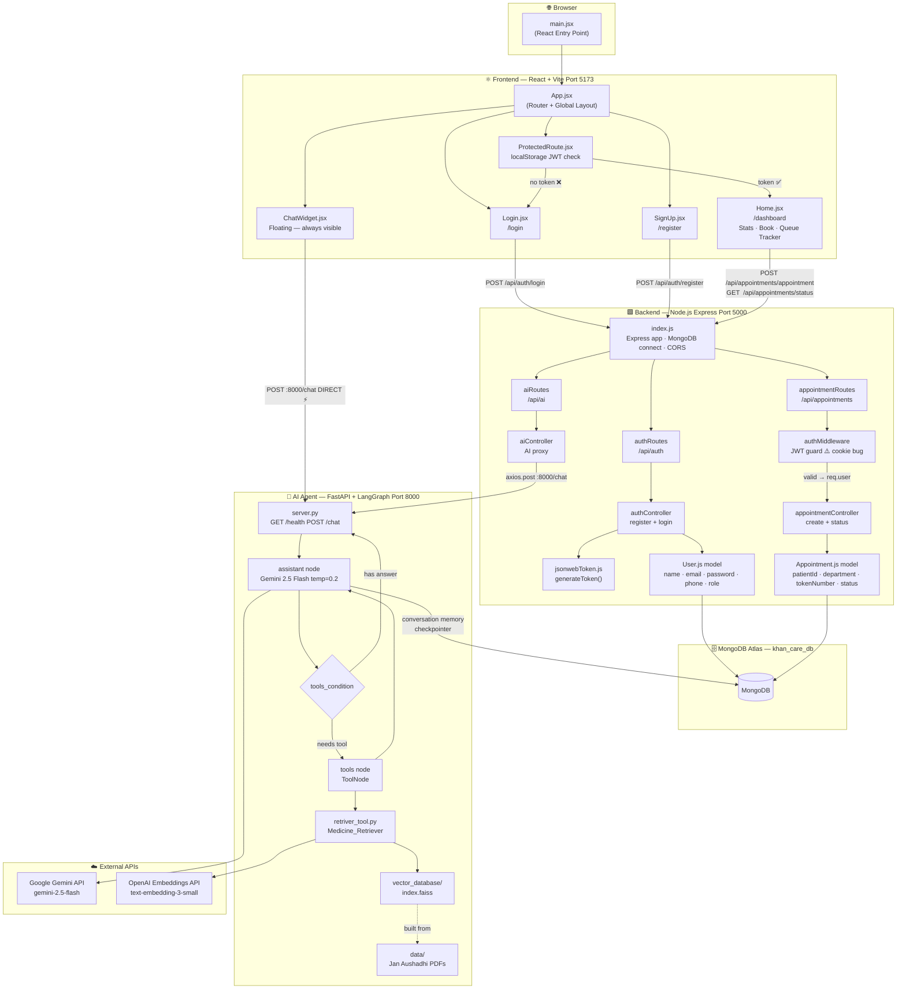

# KhanCare AI — Architecture & System Flowchart

> **Last Updated**: February 24, 2026
> **Overall Progress**: ~35% (Phase 1 functionally complete, 3 known bugs need fixing)

---

## System Overview

KhanCare AI is a **3-layer full-stack hospital management platform**:

| Layer | Technology | Port | Status |
|---|---|---|---|
| **Frontend** | React 18 + Vite + Tailwind CSS | `5173` | ✅ Built |
| **Backend** | Node.js + Express + MongoDB | `5000` | ✅ Built (1 critical bug) |
| **AI Agent** | Python + FastAPI + LangGraph | `8000` | ✅ Built & Running |

---

## What Has Been Built

### ✅ Frontend (`frontend/src/`)
| File | What It Does |
|---|---|
| `main.jsx` | React DOM entry point |
| `App.jsx` | React Router — routes `/`, `/login`, `/register`, `/dashboard`, `*` (wildcard) |
| `ProtectedRoute.jsx` | Reads `localStorage` for JWT; redirects to `/login` if missing |
| `Login.jsx` | Glassmorphic login form → `POST :5000/api/auth/login` → saves token to `localStorage` |
| `SignUp.jsx` | Registration form (name, email, password, phone) → `POST :5000/api/auth/register` |
| `Home.jsx` | Patient dashboard — stats cards (hardcoded), appointment booking form, live queue tracker |
| `ChatWidget.jsx` | Floating AI chat widget (bottom-right, always visible) → **directly** calls `POST :8000/chat` |

### ✅ Backend (`backend/`)
| File | What It Does |
|---|---|
| `index.js` | Express server — MongoDB connect, CORS, cookie-parser, mounts all routes, includes `/api/chat` proxy |
| `authController.js` | `registerUser` (password hashed via pre-save hook) + `loginUser` (bcrypt.compare) → returns JWT |
| `appointmentController.js` | `createAppointment` (duplicate pending check + create) + `getLiveStatus` (queue position counter) |
| `aiController.js` | Proxy controller — forwards `POST :5000/api/ai` to `POST :8000/chat` via axios |
| `authMiddleware.js` | Reads JWT from cookie → verifies with `JWT_SECRET` → sets `req.user` ⚠️ bug |
| `jsonwebToken.js` | `generateToken(_id, role)` → signs JWT, expires in 30 days |
| `User.js` | Mongoose model: `name, email, password (bcrypt pre-save), phone, role (patient/doctor/admin)` |
| `Appointment.js` | Mongoose model: `patientId, department, tokenNumber (auto-increment pre-save), appointmentDate, status` |

### ✅ AI Agent (`ai_agent/`)
| File | What It Does |
|---|---|
| `server.py` | FastAPI app with CORS — `GET /health`, `POST /chat` — injects Jan Aushadhi system prompt |
| `agent.py` | LangGraph graph — `assistant` node (Gemini 2.5 Flash) + `tools` node (ToolNode), MongoDB checkpointer |
| `retriver_tool.py` | Loads FAISS vector store with OpenAI `text-embedding-3-small`; exposes `Medicine_Retriever` LangChain tool |
| `vector_database/` | Pre-built FAISS index (`index.faiss`) for medicine data |
| `data/` | Source Jan Aushadhi medicine PDFs used to build the FAISS index |

---

## ⚠️ Known Bugs (Must Fix)

| # | File | Bug | Impact |
|---|---|---|---|
| 1 | `authMiddleware.js` | Reads JWT from `req.cookies.token` but frontend sends `Authorization: Bearer <token>` header | 🔴 **Critical** — all appointment routes fail |
| 2 | `appointmentController.js` | `date` and `pending` used as variables in `countDocuments()` but are never declared | 🔴 **Critical** — `createAppointment` throws ReferenceError |
| 3 | `Appointment.js` | Pre-save hook uses `this.constructure` (typo) instead of `this.constructor` | 🟡 Medium — token auto-increment silently fails |

---

## Full System Flowchart



---

## Layer-by-Layer Detail

### Frontend Flow

```
main.jsx
└── App.jsx  (React Router)
    ├── /             → redirect to /dashboard (if token) or /login
    ├── /login        → Login.jsx
    │                    └── POST :5000/api/auth/login → save token to localStorage
    ├── /register     → SignUp.jsx
    │                    └── POST :5000/api/auth/register → navigate to /login
    ├── /dashboard    → ProtectedRoute
    │   └── (token ✅) → Home.jsx
    │                    ├── GET  :5000/api/appointments/status  (queue position)
    │                    └── POST :5000/api/appointments/appointment  (book)
    └── ChatWidget.jsx  (always rendered, z-50 floating)
                         └── POST :8000/chat  ← DIRECT, bypasses Node.js
```

**Auth Token Strategy:**  JWT stored in `localStorage`. Sent as `Authorization: Bearer <token>` header for all protected API calls.

---

### Backend Flow

```
index.js  (port 5000)
│
├── /api/auth  ─────────────────────────  authRoutes.js
│   ├── POST /register ── authController.registerUser
│   │   ├── User.findOne({ email })  — duplicate check
│   │   ├── User.create()            — bcrypt pre-save hashes password
│   │   └── generateToken()          — returns JWT in response body
│   └── POST /login    ── authController.loginUser
│       ├── User.findOne({ email })
│       ├── bcrypt.compare(password, hash)
│       └── generateToken()          — returns JWT in response body
│
├── /api/ai  ────────────────────────── aiRoutes.js
│   └── POST /ask  ── aiController.getAiResponse
│       └── axios.post(":8000/chat", { query })  — forwards to Python
│
├── /api/appointments  ─────────────── appointmentRoutes.js
│   ├── POST /appointment  ── authMiddleware → appointmentController.createAppointment
│   │   ├── Appointment.findOne({ patientId, department, status:"Pending" })  — dup check
│   │   └── Appointment.create({ patientId, department, tokenNumber })
│   └── GET  /status       ── authMiddleware → appointmentController.getLiveStatus
│       ├── Appointment.findOne({ patientId, status:"Pending" })  — find active appt
│       └── Appointment.countDocuments({ tokenNo: { $lt: active.tokenNo } })  — queue position
│
└── POST /api/chat  ── (inline proxy in index.js)
    └── axios.post(":8000/chat", { query, thread_id })
```

---

### AI Agent Flow

```
server.py  (FastAPI, port 8000)
├── GET  /health   →  { status: "healthy", service: "KhanCare AI Agent" }
└── POST /chat     receives { query, thread_id }
    ├── Builds SystemMessage (Jan Aushadhi medicine expert prompt)
    ├── Builds HumanMessage (user query)
    ├── Sets RunnableConfig with thread_id for memory
    └── await agent_app.ainvoke(messages, config)

agent.py  (LangGraph StateGraph)
├── LLM: ChatGoogleGenerativeAI("gemini-2.5-flash", temperature=0.2)
├── Tools: [Medicine_Retriever]
├── AgentState: { messages: Annotated[List, add_messages] }
├── Graph:
│   START → assistant_node
│   assistant_node → tools_condition
│     ├── "tools"   → tools_node → assistant_node  (loop until done)
│     └── "__end__" → END
└── Checkpointer: MongoDBSaver(khan_care_db / checkpoints)

retriver_tool.py
└── FAISS.load_local("vector_database/", OpenAIEmbeddings("text-embedding-3-small"))
    retriever: k=3 similar documents
    tool: Medicine_Retriever
          "Search Jan Aushadhi generic medicine prices and details"
```

**LangGraph Decision Loop:**
```
User Query
    │
    ▼
assistant_node (Gemini thinks)
    │
    ├── needs medicine info? ──► tools_node ──► Medicine_Retriever ──► FAISS
    │                                 │
    │         ◄────────────── results back to assistant_node
    │
    └── has full answer? ──────────────────────────────────► END → response
```

---

## Request–Response Walkthroughs

### Register a new user
```
Frontend: POST :5000/api/auth/register { name, email, password, phone }
          → User.findOne() — check no duplicate email
          → User.create() — bcrypt pre-save hook hashes password
          → generateToken(_id, role)
Response: 201 { _id, name, email, role, token, message }
```

### Login
```
Frontend: POST :5000/api/auth/login { email, password }
          → User.findOne({ email })
          → bcrypt.compare(enteredPassword, user.password)
          → generateToken(_id, role)
Response: 200 { _id, name, email, role, token }
Token: saved to localStorage by Login.jsx → user navigates to /dashboard
```

### Book appointment (after bug fix)
```
Frontend: POST :5000/api/appointments/appointment { department }
          Headers: { Authorization: "Bearer <token>" }
          → authMiddleware: reads Authorization header → verifies JWT → req.user
          → Appointment.findOne({ patientId, department, status:"Pending" }) — dup check
          → Appointment.create({ patientId, department, tokenNumber })
Response: 201 { message: "New Patient Registered Successfully", data: appointment }
```

### Get queue status
```
Frontend: GET :5000/api/appointments/status
          Headers: { Authorization: "Bearer <token>" }
          → authMiddleware → getLiveStatus
          → Appointment.findOne(patientId, status:"Pending") — active appointment
          → Appointment.countDocuments(tokenNo < active.tokenNo) — people ahead
Response: 200 { hasActiveAppointment: true, data: { ...appt, peopleAhead } }
```

### AI Chat (current live path)
```
ChatWidget: POST :8000/chat { query: "What is the price of Paracetamol?" }
(bypasses Node.js entirely)
            → server.py: prepends system prompt
            → agent.py: Gemini receives messages
            → Gemini decides to call Medicine_Retriever
            → retriver_tool.py: FAISS similarity search → top 3 PDF chunks
            → Gemini generates final answer with MRP and unit size
            → MongoDBSaver: saves conversation state by thread_id
Response: { response: "Paracetamol 500mg is available at ₹X...", thread_id: "..." }
```

---

## File Dependency Map (Quick Reference)

```
BACKEND
index.js
├── routes/authRoutes.js
│   └── controller/authController.js
│       ├── models/User.js ──────────────── MongoDB Atlas
│       └── utils/jsonwebToken.js
├── routes/aiRoutes.js
│   └── controller/aiController.js
│       └── axios ───────────────────────► server.py (:8000)
└── routes/appointmentRoutes.js
    ├── middleware/authMiddleware.js ⚠️
    └── controller/appointmentController.js ⚠️
        └── models/Appointment.js ⚠️ ────── MongoDB Atlas

AI AGENT
server.py (:8000)
└── agent.py
    ├── retriver_tool.py
    │   └── vector_database/index.faiss  ← built from data/*.pdf
    ├── Google Gemini API  (LLM inference)
    ├── OpenAI Embeddings API  (vector search)
    └── MongoDB Atlas  (conversation checkpointer)

FRONTEND
App.jsx
├── pages/Login.jsx     ──────────────────► :5000/api/auth/login
├── pages/SignUp.jsx    ──────────────────► :5000/api/auth/register
├── pages/Home.jsx      ──────────────────► :5000/api/appointments/*
├── components/ProtectedRoute.jsx  (localStorage check)
└── components/ChatWidget.jsx ───────────► :8000/chat  (DIRECT)
```

---

## Environment Variables Required

| Location | Variable | Purpose |
|---|---|---|
| `backend/.env` | `MONGO_URI` | MongoDB Atlas connection string |
| `backend/.env` | `JWT_SECRET` | JWT signing secret |
| `backend/.env` | `PORT` | Express port (default `5000`) |
| `ai_agent/.env` | `GOOGLE_API_KEY` | Gemini 2.5 Flash LLM access |
| `ai_agent/.env` | `OPENAI_API_KEY` | Text embedding for FAISS search |
| `ai_agent/.env` | `MONGO_URL` | MongoDB for LangGraph conversation memory |

---

## Roadmap — What's Left

| Phase | Goal | Remaining Work |
|---|---|---|
| **Bug Fixes** | Make Phase 1 fully functional | Fix `authMiddleware` (header), fix `appointmentController` vars, fix `Appointment.js` pre-save |
| **Phase 1 Complete** | User profiles + doctor schema | Doctor profile fields, `/api/auth/profile` endpoint, role-based UI routing |
| **Phase 2** | AI Receptionist | Symptom → department triage, connect AI recommendation to appointment booking |
| **Phase 3** | Smart Queuing | Real-time queue updates via Socket.io, doctor-side queue management panel |
| **Phase 4** | Medicine & Inventory | Inventory tracking, AI-suggested generics, Jan Aushadhi lookup in booking flow |
| **Phase 5** | Command Center | Admin analytics dashboard, live operational stats |
