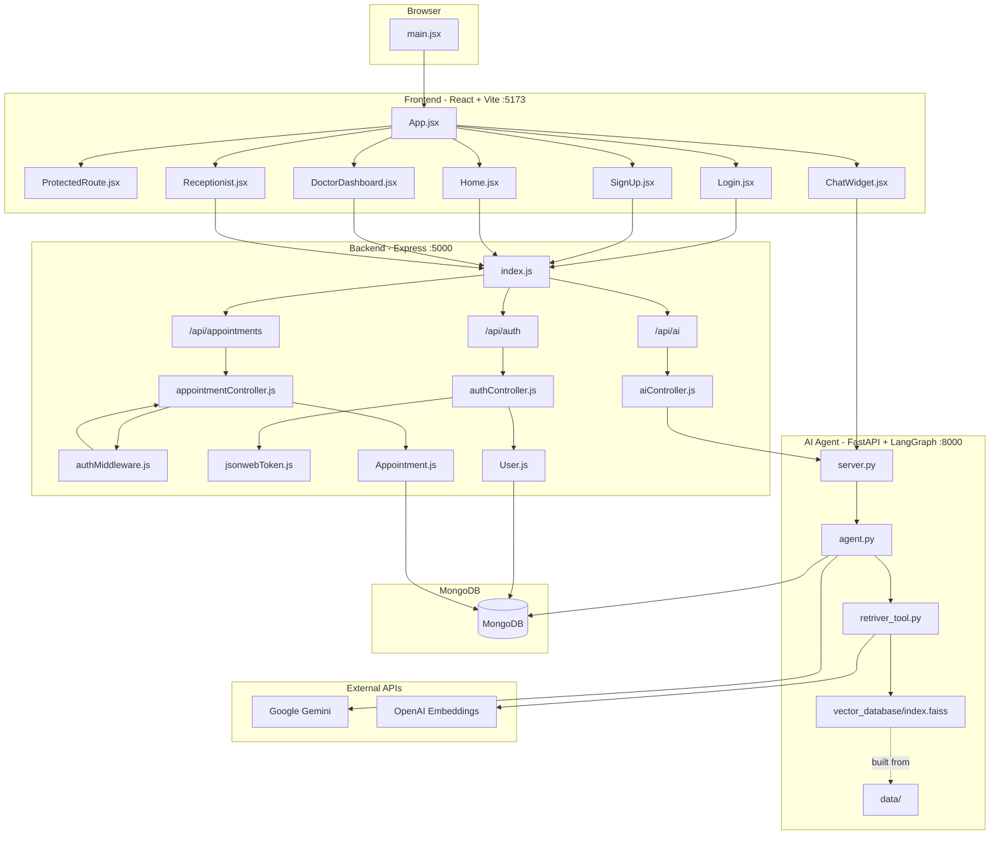

# KhanCare AI – Intelligent Hospital Management & Triage System

KhanCare AI is a comprehensive, microservices-based healthcare management system designed to optimize hospital workflows and enhance the patient experience.

At its core, the platform bridges the gap between hospital administration and patient care. It features a robust MERN-stack operations portal providing dedicated, real-time dashboards for patients, receptionists, and doctors to manage token-based appointment queues.

The standout feature is its Advanced AI Triage Agent, powered by Python, LangGraph, and a Qdrant Vector Database. This agent safely interacts with patients to understand their symptoms, offers general first-aid guidance, and strictly routes them to the appropriate specialist (e.g., Cardiology, Orthopedics). Additionally, it integrates a RAG-based knowledge system to help patients query affordable generic medicines via the Jan Aushadhi database, making healthcare both accessible and intelligent.

KhanCare AI is a hospital operations platform with three parts:

1. A React frontend for patients, receptionists, and doctors.
2. A Node.js + Express backend for authentication, appointments, and AI proxy routes.
3. A Python FastAPI AI agent that answers medicine-related queries using a FAISS knowledge base.

The current codebase supports:

- Patient login and registration
- Appointment booking with token assignment by department and date
- Receptionist queue viewing
- Doctor queue viewing
- AI chat for Jan Aushadhi medicine lookup

---

## Tech Stack

### Frontend

- React 18
- Vite
- React Router DOM
- Axios
- Tailwind CSS
- Lucide React

### Backend

- Node.js
- Express
- MongoDB
- Mongoose
- JWT authentication
- bcrypt password hashing
- CORS
- Cookie Parser
- Axios

### AI Agent

- Python 3.9+
- FastAPI
- LangGraph
- LangChain
- OpenAI embeddings
- FAISS
- MongoDB checkpointer
- Google Gemini

---

## Project Structure

```text
KhanCare_AI/
├── ARCHITECTURE.md
├── PROGRESS.md
├── README.md
├── frontend/
│   ├── index.html
│   ├── package.json
│   ├── eslint.config.js
│   ├── postcss.config.js
│   ├── tailwind.config.js
│   ├── vite.config.js
│   ├── public/
│   └── src/
│       ├── App.css
│       ├── App.jsx
│       ├── index.css
│       ├── main.jsx
│       ├── components/
│       │   ├── ChatWidget.jsx
│       │   └── ProtectedRoute.jsx
│       └── pages/
│           ├── DoctorDashboard.jsx
│           ├── Home.jsx
│           ├── Landing.jsx
│           ├── Login.jsx
│           ├── Receptionist.jsx
│           └── SignUp.jsx
├── backend/
│   ├── index.js
│   ├── package.json
│   ├── seed.js
│   ├── controller/
│   │   ├── aiController.js
│   │   ├── appointmentController.js
│   │   └── authController.js
│   ├── middleware/
│   │   └── authMiddleware.js
│   ├── models/
│   │   ├── Appointment.js
│   │   └── User.js
│   ├── routes/
│   │   ├── aiRoutes.js
│   │   ├── appointmentRoutes.js
│   │   └── authRoutes.js
│   └── utils/
│       └── jsonwebToken.js
└── ai_agent/
    ├── agent.py
    ├── index.py
    ├── retriver_tool.py
    ├── server.py
    ├── requirements.txt
    ├── data/
    └── vector_database/
        └── index.faiss
```

---

## Architecture Overview



---

## How the App Works

### Frontend flow

- `App.jsx` defines routes for landing, login, register, patient dashboard, receptionist desk, and doctor desk.
- `ProtectedRoute.jsx` checks whether a JWT exists in `localStorage` before allowing access to protected pages.
- `Login.jsx` calls `POST /api/auth/login` and stores the returned token and role.
- `SignUp.jsx` calls `POST /api/auth/register`.
- `Home.jsx` is the patient page for booking and queue status.
- `Receptionist.jsx` shows all appointments.
- `DoctorDashboard.jsx` shows the doctor queue for the current day.
- `ChatWidget.jsx` calls the AI agent directly for medicine-related questions.

### Backend flow

- `index.js` starts the Express server, connects MongoDB, enables CORS, and mounts routes.
- `authRoutes.js` handles login and registration.
- `appointmentRoutes.js` handles booking, status, receptionist view, completion, and doctor queue.
- `aiRoutes.js` forwards AI prompts to the Python agent.
- `authMiddleware.js` reads the JWT from the `Authorization` header.
- `authController.js` creates and verifies user sessions.
- `appointmentController.js` creates appointments, calculates queue position, and loads doctor/receptionist views.

### AI flow

- `server.py` exposes `GET /health` and `POST /chat`.
- `agent.py` runs the LangGraph agent.
- `retriver_tool.py` loads the FAISS index and returns medicine matches.
- `index.py` builds the vector database from the Jan Aushadhi PDF.

---

## API Endpoints

### Authentication

```http
POST /api/auth/register
POST /api/auth/login
```

### Appointments

```http
POST /api/appointments/appointment
GET  /api/appointments/status
GET  /api/appointments/receptionist
PUT  /api/appointments/complete/:id
GET  /api/appointments/doctor
```

### AI

```http
POST /api/ai/ask
POST /api/chat
```

### AI Agent

```http
GET  /health
POST /chat
```

---

## Request Examples

### Register

```json
{
  "name": "Krishna",
  "email": "krishna@example.com",
  "password": "123456",
  "phone": "9999999999"
}
```

### Login

```json
{
  "email": "krishna@example.com",
  "password": "123456"
}
```

### Book appointment

```json
{
  "department": "Cardiology",
  "date": "2026-04-09"
}
```

Headers:

```http
Authorization: Bearer <jwt-token>
```

### AI chat

```json
{
  "message": "What is the price of Paracetamol?"
}
```

---

## Setup Instructions

### Prerequisites

- Node.js 18+
- Python 3.9+
- MongoDB Atlas or local MongoDB

### 1. Frontend

```bash
cd frontend
npm install
npm run dev
```

### 2. Backend

```bash
cd backend
npm install
npm start
```

If `npm start` is not defined in `backend/package.json`, run:

```bash
npx nodemon index.js
```

### 3. AI Agent

```bash
cd ai_agent
python -m venv venv
venv\\Scripts\\activate
pip install -r requirements.txt
uvicorn server:app --reload
```

---

## Environment Variables

### backend/.env

```env
MONGO_URI=<your-mongodb-connection-string>
JWT_SECRET=<your-jwt-secret>
PORT=5000
```

### ai_agent/.env

```env
GOOGLE_API_KEY=<your-gemini-key>
OPENAI_API_KEY=<your-openai-key>
MONGO_URL=<your-mongodb-connection-string>
```

---

## Current Notes

- Appointments are assigned token numbers per department and date.
- The doctor queue is filtered by the doctor’s department and the current day.
- The receptionist can see all appointments.
- The AI chat uses the Python agent and does not go through the appointment APIs.
- Real-time Socket.IO updates are not active in the current code path.

---

## License

MIT
